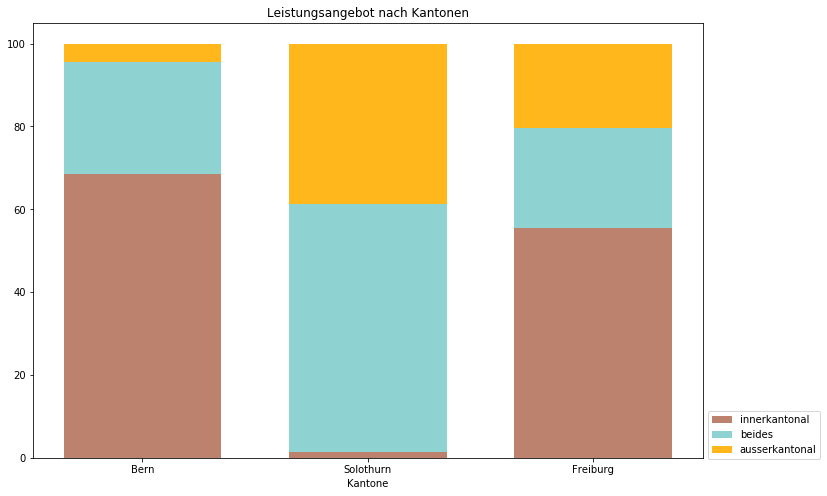

# Spitalpolitik: es gibt Unterschiede

#### *Auch nach der Einführung der freien Spitalwahl bleiben die Kantonsgrenzen entscheidend. Die Kantone Bern, Freiburg und Solothurn arbeiten zusammen, allerdings aus unterschiedlichen Gründen.*

Günstiger und besser sollte das Schweizer Spitalsystem mit der neuen Spitalfinanzierung werden. Sie wurde 2012 eingeführt und sollte unter anderem den Patienten mehr Auswahl bei der Wahl eines Spitals geben.  Damit, so die Hoffnung der Politik, müsste nicht mehr jedes regionale Spital möglichst viele, möglichst spezialisierte Leistungen anbieten. Wenn sich Spitalstandorte auf einzelne Angebote konzentrierten, sollte die Qualität steigen, während die Kosten dafür hätten sinken sollen. 

Seit der Einführung des neuen Systems sind die Kosten im Spitalwesen sind weiter gestiegen: Von 70 Milliarden im Jahr 2012 auf 78 Milliarden 2015*. Und auch die Zahl der Spitalbetten in den Kantonen ist gestiegen, von 3 Spitalbetten pro 1000 Einwohnerinnen auf 5.5 Betten. 

Wir konzentrieren uns im Folgenden auf drei Kantone: Bern, Freiburg und Solothurn. In Bern und Freiburg hat die Zahl der Spitalbetten pro 1000 Einwohnerinnen seit 2011 abgenommen. In Solothurn nahm sie leicht zu. Hätte tatsächlich eine Zentralisierung stattgefunden, hätte man davon ausgehen können, dass in Bern die Betten zugenommen hätten, während sie in Solothurn hätten sinken müssen. 
Der gewünschte Effekt trat also nicht ein. Das kann verschiedene Gründe haben, einer davon dürfte aber auch sein, dass die freie Spitalwahl in der Praxis nicht so frei ist wie sie klingt. 

 
### Spitalpolitik mit Listen

Einschränkungen bei der Spitalwahl gibt es für die Patienten auch mit der freien Spitalwahl. Ohne Zusatzversicherung können sie ihr Spital nur dann ausserhalb des Kantons wählen wenn
-	ihr Heimatkanton die Behandlung auf seiner Spitalliste auch in einem Spital ausserhalb zulässt
-	der Referenztarif für die Behandlung tiefer ist als der Basistarif ihres Heimatkantons.
Den Basistarif für eine Behandlung handeln die Kantone mit den Krankenkassen aus. Den Referenztarif legen sie selbst fest. 
Trifft keines der Kriterien zu, bezahlen die Patienten einen Aufpreis: die Differenz zwischen dem Tarif, den die Behandlung wohl im Heimatkanton gekostet hätte zu den effektiven Kosten im Spital ausserhalb. Über diese zwei Instrumente, den Spitallisten dem Referenztarif können die Kantone es ihren Bewohnerinnen leichter oder schwieriger machen, sich ausserhalb der Kantonsgrenzen behandeln zu lassen. (Den Referenztarif lassen wir hier weg weil das führt zu weit.)

### Für und wider die Zentralisierung
Ein Spital zu unterhalten ist teuer, gerade wenn es um spezialisierte Medizin geht. Ländlichere Kantone könnten also das Angebot ihrer eigenen Spitäler auf ein Minimum beschränken und sich darauf verlassen, dass sich ihre Bevölkerung ohnehin lieber in einem Universtätspital in einem benachbarten Kanton behandeln lässt. 

Nur, für die Kantone sind ihre Spitäler auch ein Standortfaktor. Sie schaffen Arbeitsplätze, sie können wichtig sein als Ausbildungsstätte, und bringen Prestige. Streichungen von Leistungen an Spitälern sind politisch unpolär. Und besteht einmal ein Angebot, wird auch eine Nachfrage benötigt. Das hat zur Folge, dass auch wenn auf Bundesebene die Zentralisierung des Spitalangebots gewünscht wird, es für die Kantone Argumente gibt, eine gegenteilige Strategie zu verfolgen.  

### Ohne Zusammenarbeit geht es nicht
So oder so, die Kantone müssen auf ihren Spitallisten sämtliche verfügbaren Spitalbehandlungen abdecken. Das kann innerhalb des Kantons, ausserhalb oder sowohl als auch sein. Eine Analyse der Spitallisten von Bern, Freiburg und Solothurn zeigt: die Kantone sind auf Zusammenarbeit angewiesen, sie alle berücksichtigen auch Spitäler ausserhalb ihrer Kantonsgrenzen. 

Bern hat sein Kantonsgebiet in Versorgungsregionen eingeteilt und bezieht an den Kantonsgrenzen auch andere regionale Spitäler in seine Planung mit ein, aus Solothurn, dem Jura und Neuchâtel. Nur von Freiburg gibt es keine Spitäler auf der Berner Liste. In der deutschsprachigen Grenzregion Bern-Freiburg dürfte das Bedürfnis, sich in Freiburg auf Französisch behandeln zu lassen klein sein. 
Umgekehrt ist Bern aus der Freiburger Spitallandschaft nicht wegzudenken. Das Inselspital ist mit 59 zugelassenen Leistungen nach dem Kantonsspital HFR (110 von 138 Leistungen) das wichtigste Spital auf der Freiburger Spitalliste. 
Solothurn wiederum führt nur drei innerkantonale Spitäler auf seiner Spitalliste. Dafür erlaubt der Kanton auch, dass sich Patientinnen in Basel, Bern und im Aargau behandeln lassen. 

### Wie viel Auswahl die Kantone erlauben

Der Umstand, dass ein Kanton ein Spital ausserhalb der Kantonsgrenzen auf seiner Liste führt, sagt aber noch nichts darüber aus, wie viel Auswahl die Patientinnen haben. 
Tatsächlich gibt es diese im Kanton Solothurn. Solothurner können bei einem Grossteil der Spitalbehandlungen (60 Prozent) in Solothurn bleiben, ins Kantonsspital Baselland gehen oder das Universitäts-Kinderspital beider Basel aufsuchen. Und bei knapp 40 Prozent bleibt ihnen keine andere Wahl als ein Spital ausserhalb des Kantons aufzusuchen.

Anders handhabt das der Kanton Freiburg: Für einen mehr als die Hälfte der Leistungen sieht die Spitalliste nur in kantonsinterne Spitäler vor, insbesondere bei eher einfachen Behandlungen. Überschneidungen gibt es bei komplexeren Therapien wie der Krebsmedizin, (25 Prozent) hier erlaubt die Spitalliste sowohl innerkantonale wie ausserkantonale Spitäler. Und trotz allen Ambitionen Freiburgs, komplexe Medizin im Kanton zu behalten, gibt es gut einen Viertel der Leistungen, für die Patienten in einen Kanton zur Behandlung müssen. 

Bern als Kanton mit Zentrumsfunktion hat mit knapp 70 Prozent einen beträchtlichen Anteil an Leistungen, welche nur im Kanton angeboten werden. Dabei handelt es sich anders als in Freiburg vor allem um komplexere Behandlungen. Überschneidungen gibt es bei leichteren Eingriffen (27 Prozent), hier kommen auch ausserkantonale Spitäler zum Zug. Und schliesslich werden 6 Leistungen nicht in Bern angeboten. Dabei handelt es sich um hochspezialisierte Eingriffe wie Lungentransplantationen oder die Behandlung von grossflächigen Verbrennungen. Hier haben die Kantone eine Vereinbarung getroffen, dass diese Eingriffe nur von wenigen Zentren in der Schweiz vorgenommen werden können. In der hochspezialisierten Medizin funktioniert die Zentralisierung von Leistungen also. Allerdings nicht durch den freien Markt, sondern durch mehr Absprachen und Reglementierung unter den Kantonen. 

### Die Sache mit den Kosten

Im Jahr 2018 hat Solothurn 280 Millionen Franken, Freiburg 290 Millionen und Bern 1.2 Milliarden Franken für Spitalkosten ausgegeben. Das macht 13, 8, bzw 12 Prozent des Gesamtaufwandes des Budgets. 
Diese Zahlen sind jedoch mit Vorsicht zu geniessen: Während Solothurn einen Posten «Spitalkosten» separat in seinem Jahresbericht ausweist, präsentiert Bern zwei verschiedene Rechenmethoden mit unterschiedlichen Ergebnissen für die Kategorie. Und Freiburg listet einzelne Budgetposten auf, welche ich eigens zusammengerechnet habe. Um die Angaben der Kantone vergleichen zu können, wären Telefonanrufe bei den drei Kantonen nötig um sicherzugehen, dass dieselben Budgetposten in den Summen enthalten sind. 
Alternativ sind die Kosten auch in den Kennzahlen der Schweizer Spitäler des Bundesamts für Statistik enthalten. Um diese Berechnung aber richtig anzustellen wäre auch hier Unterstützung durch das BFS nötig.

Die Kantone zahlen nicht nur über Spitalbehandlungen Geld an die Spitäler. Öffentliche Spitäler erhalten Geld für Gemeinwirtschaftliche Leistungen, welche unter anderem Beträge für die Lehre und Forschung eines Spitals enthalten. Wenn man will kann man ausserdem auch einen hohen Basistarif für die Abrechnung von Spitalleistungen und Investitionen der Kantone in die Spitäler als indirekte Subvention werten. Die Schweizer Privatkliniken wollten, und beauftragten die Uni Basel mit einem Gutachten*. Dieses kommt zum Schluss, dass die Kantone seit 2013 ihre Spitäler immer stärker finanziell unterstützen. Im Jahr 2017 waren es der Untersuchung zufolge 2.5 Milliarden Franken. 

Im Gutachten fällt auf, dass das jeweils grösste Spital von Bern, Freiburg und Solothurn unter den acht Schweizer Spitälern sind, welche am stärksten von ihrem Standortkanton unterstützt werden. 

Der erste Blick hier zeigt, dass eine liberale Spitalliste, wie sie Solothurn führt, nicht automatisch zu weniger Kosten für die Kantone führt. Einen direkten Zusammenhang zwischen Kosten und Spitallisten lässt sich nicht herstellen, dafür wirken zu viele Faktoren mit: unter anderem die finanzielle Lage der Spitäler eines Kantons, die Geographie der Kantone, der Umstand, dass seit 2012 der Abrechnungsschlüssel von Kantons- und Versicherungsanteil geändert hat, und wie viele Patienten im Kanton sich ungeachtet der Spitallisten in einem ausserkantonalen Spital behandeln lassen.  

### Fazit

Zusammenfassend war das hier alles interessant, aber keine Geschichte. Zu Beginn habe ich mir folgende Fragen gestellt: 
- Wie viele Akutspitäler die Kantone pro Einwohner unterhalten
- Welche komplexen Behandlungen werden in mehreren Spitälern im Kanton angeboten
- Die kleinsten Spitäler mit komplexer Medizin

Diese Angaben sind in den Spitallisten, respektive den Kennzahlen zu den Spitälern enthalten. Aber was als komplexe Behandlung zählt, ist schwierig einzuteilen. Wenn ich so tief in die Daten eintauchen würde, so meine Sorge, würde ich mich darin verlieren. Ausserdem suggerieren die Recherchefragen, dass die Spitäler zu viel Doppelspurigkeiten anbieten. Jetzt nachdem ich mich mit den Daten befasst habe, bin ich nicht sicher an was ich ein allfälliges Überangebot festmachen würde. 

Was die Daten hier zeigen, ist dass die Bern, Freiburg und Solothurn unterschiedliche Strategien in ihrer Spitalplanung verfolgen. Damit dargelegt werden könnte, wie sich diese Strategien bewähren, bräuchte es mehr Vergleichspunkte:  Etwa indem eine Entwicklung der Spitallisten über mehrere Jahre relativ zu den Kosten aufgezeigt würde, oder mehr Kantone berücksichtigt würden. Beides sprengt den Rahmen dieser Arbeit. 

Für mich war die Arbeit eine gute Erfahrung, meine Fähigkeiten im Umgang mit Pandas zu vertiefen, und mehr zu Plots und zu Netzwerken zu lernen. Ausserdem denke ich, kann ich jetzt Projektideen besser einschätzen wie gut sie für eine Realisierung taugen.  
